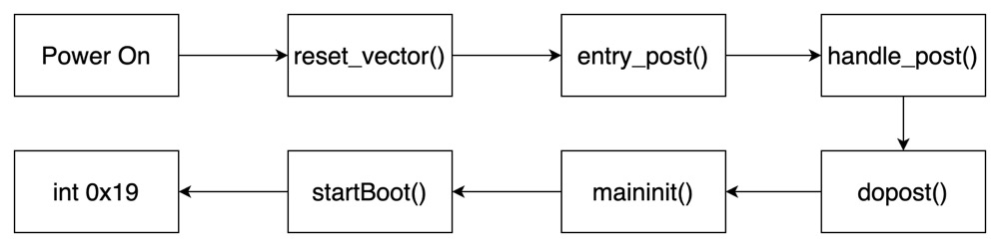

# Part 1: PC Bootstrap


## Getting Started with x86 Assembly

每一个lab都由若干个exercise组成，有些是简单的问答题，有些则需要动手写代码。第一个exercise的内容如下，要求熟悉x86汇编。

> **Exercise 1.** Familiarize yourself with the assembly language materials available on [the 6.828 reference page](https://pdos.csail.mit.edu/6.828/2018/reference.html). You don't have to read them now, but you'll almost certainly want to refer to some of this material when reading and writing x86 assembly.
>
> We do recommend reading the section "The Syntax" in [Brennan's Guide to Inline Assembly](http://www.delorie.com/djgpp/doc/brennan/brennan_att_inline_djgpp.html). It gives a good (and quite brief) description of the AT&T assembly syntax we'll be using with the GNU assembler in JOS.

如果你对x86汇编不熟悉，可以参考appendix中[x86_assembly](../appendix/x86_assembly.md)对x86汇编的简单介绍，主要包括x86汇编的基本用法，实模式与保护模式的基本概念等。

在6.828中使用的x86汇编格式是AT&T，而非Intel格式。

## Simulating the x86

6.828中使用qemu来模拟（80836）PC机，方便调试。

课程代码中已经为我们写好了编译jos与使用qemu运行jos的Makefile。编译只需要执行`make`:

```shell
$ make
+ as kern/entry.S
+ cc kern/entrypgdir.c
+ cc kern/init.c
+ cc kern/console.c
+ cc kern/monitor.c
+ cc kern/printf.c
+ cc kern/kdebug.c
+ cc lib/printfmt.c
+ cc lib/readline.c
+ cc lib/string.c
+ ld obj/kern/kernel
i386-jos-elf-ld: warning: section `.bss' type changed to PROGBITS
+ as boot/boot.S
+ cc -Os boot/main.c
+ ld boot/boot
boot block is 382 bytes (max 510)
+ mk obj/kern/kernel.img
```

 经过编译之后得到的是`obj/kern/kernel.img`，如果你有装系统的经验，这里的`kernel.img`类似于`iso`文件，是系统镜像。

用qemu运行这个“系统”只需要执行`make qemu-nox`，`-nox`会将qemu的内容直接输出到当前的terminal。

```shell
$ make qemu-nox
sed "s/localhost:1234/localhost:26000/" < .gdbinit.tmpl > .gdbinit
***
*** Use Ctrl-a x to exit qemu
***
qemu-system-i386 -nographic -drive file=obj/kern/kernel.img,index=0,media=disk,format=raw -serial mon:stdio -gdb tcp::26000 -D qemu.log
6828 decimal is XXX octal!
entering test_backtrace 5
entering test_backtrace 4
entering test_backtrace 3
entering test_backtrace 2
entering test_backtrace 1
entering test_backtrace 0
leaving test_backtrace 0
leaving test_backtrace 1
leaving test_backtrace 2
leaving test_backtrace 3
leaving test_backtrace 4
leaving test_backtrace 5
Welcome to the JOS kernel monitor!
Type 'help' for a list of commands.
K>
```

到这里我们成功的boot了jos，如果在整个过程中出错，大概率是工具链配置错误，最简单的解决方法是选择使用虚拟机:)。

### What happens when make ?

如果你对`make`与`make qemu-nox`的具体细节不感兴趣，可以跳过。但我强烈建议你读一读这一部分内容。

执行`make clean`:

```shell
$ make clean
rm -rf obj .gdbinit jos.in qemu.log
```

`make clean`删掉了`obj`文件夹，obj文件夹里面有一些编译的中间产物(.o或者.out文件)以及方便查看的反汇编文件(.asm)。同时也删除了其余用于调试或者测试的中间文件。

重新执行`make`，这次使用`make -n`或者`make V=1`

> `make -n`会打印出所有将要执行的命令，但并不执行。执行`man make`去读make的相关文档：
> -n, --just-print, --dry-run, --recon
> Print the commands that would be executed, but do not execute them (except in certain circumstances).
>
> `make V=1`打印并执行所有命令。

```shell
$ make V=1
echo "   -O1 -fno-builtin -I. -MD -fno-omit-frame-pointer -std=gnu99 -static -Wall -Wno-format -Wno-unused -Werror -gstabs -m32 -fno-tree-ch -fno-stack-protector -DJOS_KERNEL -gstabs" | cmp -s obj/.vars.KERN_CFLAGS || echo "   -O1 -fno-builtin -I. -MD -fno-omit-frame-pointer -std=gnu99 -static -Wall -Wno-format -Wno-unused -Werror -gstabs -m32 -fno-tree-ch -fno-stack-protector -DJOS_KERNEL -gstabs" > obj/.vars.KERN_CFLAGS
+ as kern/entry.S
i386-jos-elf-gcc -pipe -nostdinc    -O1 -fno-builtin -I. -MD -fno-omit-frame-pointer -std=gnu99 -static -Wall -Wno-format -Wno-unused -Werror -gstabs -m32 -fno-tree-ch -fno-stack-protector -DJOS_KERNEL -gstabs -c -o obj/kern/entry.o kern/entry.S
+ cc kern/entrypgdir.c
i386-jos-elf-gcc -pipe -nostdinc    -O1 -fno-builtin -I. -MD -fno-omit-frame-pointer -std=gnu99 -static -Wall -Wno-format -Wno-unused -Werror -gstabs -m32 -fno-tree-ch -fno-stack-protector -DJOS_KERNEL -gstabs -c -o obj/kern/entrypgdir.o kern/entrypgdir.c
echo "" | cmp -s obj/.vars.INIT_CFLAGS || echo "" > obj/.vars.INIT_CFLAGS
+ cc kern/init.c
i386-jos-elf-gcc -pipe -nostdinc    -O1 -fno-builtin -I. -MD -fno-omit-frame-pointer -std=gnu99 -static -Wall -Wno-format -Wno-unused -Werror -gstabs -m32 -fno-tree-ch -fno-stack-protector -DJOS_KERNEL -gstabs  -c -o obj/kern/init.o kern/init.c
+ cc kern/console.c
i386-jos-elf-gcc -pipe -nostdinc    -O1 -fno-builtin -I. -MD -fno-omit-frame-pointer -std=gnu99 -static -Wall -Wno-format -Wno-unused -Werror -gstabs -m32 -fno-tree-ch -fno-stack-protector -DJOS_KERNEL -gstabs -c -o obj/kern/console.o kern/console.c
+ cc kern/monitor.c
i386-jos-elf-gcc -pipe -nostdinc    -O1 -fno-builtin -I. -MD -fno-omit-frame-pointer -std=gnu99 -static -Wall -Wno-format -Wno-unused -Werror -gstabs -m32 -fno-tree-ch -fno-stack-protector -DJOS_KERNEL -gstabs -c -o obj/kern/monitor.o kern/monitor.c
+ cc kern/printf.c
i386-jos-elf-gcc -pipe -nostdinc    -O1 -fno-builtin -I. -MD -fno-omit-frame-pointer -std=gnu99 -static -Wall -Wno-format -Wno-unused -Werror -gstabs -m32 -fno-tree-ch -fno-stack-protector -DJOS_KERNEL -gstabs -c -o obj/kern/printf.o kern/printf.c
+ cc kern/kdebug.c
i386-jos-elf-gcc -pipe -nostdinc    -O1 -fno-builtin -I. -MD -fno-omit-frame-pointer -std=gnu99 -static -Wall -Wno-format -Wno-unused -Werror -gstabs -m32 -fno-tree-ch -fno-stack-protector -DJOS_KERNEL -gstabs -c -o obj/kern/kdebug.o kern/kdebug.c
+ cc lib/printfmt.c
i386-jos-elf-gcc -pipe -nostdinc    -O1 -fno-builtin -I. -MD -fno-omit-frame-pointer -std=gnu99 -static -Wall -Wno-format -Wno-unused -Werror -gstabs -m32 -fno-tree-ch -fno-stack-protector -DJOS_KERNEL -gstabs -c -o obj/kern/printfmt.o lib/printfmt.c
+ cc lib/readline.c
i386-jos-elf-gcc -pipe -nostdinc    -O1 -fno-builtin -I. -MD -fno-omit-frame-pointer -std=gnu99 -static -Wall -Wno-format -Wno-unused -Werror -gstabs -m32 -fno-tree-ch -fno-stack-protector -DJOS_KERNEL -gstabs -c -o obj/kern/readline.o lib/readline.c
+ cc lib/string.c
i386-jos-elf-gcc -pipe -nostdinc    -O1 -fno-builtin -I. -MD -fno-omit-frame-pointer -std=gnu99 -static -Wall -Wno-format -Wno-unused -Werror -gstabs -m32 -fno-tree-ch -fno-stack-protector -DJOS_KERNEL -gstabs -c -o obj/kern/string.o lib/string.c
echo "-m elf_i386 -T kern/kernel.ld -nostdlib" | cmp -s obj/.vars.KERN_LDFLAGS || echo "-m elf_i386 -T kern/kernel.ld -nostdlib" > obj/.vars.KERN_LDFLAGS
+ ld obj/kern/kernel
i386-jos-elf-ld -o obj/kern/kernel -m elf_i386 -T kern/kernel.ld -nostdlib obj/kern/entry.o obj/kern/entrypgdir.o obj/kern/init.o obj/kern/console.o obj/kern/monitor.o obj/kern/printf.o obj/kern/kdebug.o  obj/kern/printfmt.o  obj/kern/readline.o  obj/kern/string.o /usr/local/lib/gcc/i386-jos-elf/4.6.4/libgcc.a -b binary
i386-jos-elf-ld: warning: section `.bss' type changed to PROGBITS
i386-jos-elf-objdump -S obj/kern/kernel > obj/kern/kernel.asm
i386-jos-elf-nm -n obj/kern/kernel > obj/kern/kernel.sym
+ as boot/boot.S
i386-jos-elf-gcc -pipe -nostdinc    -O1 -fno-builtin -I. -MD -fno-omit-frame-pointer -std=gnu99 -static -Wall -Wno-format -Wno-unused -Werror -gstabs -m32 -fno-tree-ch -fno-stack-protector -DJOS_KERNEL -gstabs -c -o obj/boot/boot.o boot/boot.S
+ cc -Os boot/main.c
i386-jos-elf-gcc -pipe -nostdinc    -O1 -fno-builtin -I. -MD -fno-omit-frame-pointer -std=gnu99 -static -Wall -Wno-format -Wno-unused -Werror -gstabs -m32 -fno-tree-ch -fno-stack-protector -DJOS_KERNEL -gstabs -Os -c -o obj/boot/main.o boot/main.c
+ ld boot/boot
i386-jos-elf-ld -m elf_i386 -N -e start -Ttext 0x7C00 -o obj/boot/boot.out obj/boot/boot.o obj/boot/main.o
i386-jos-elf-objdump -S obj/boot/boot.out >obj/boot/boot.asm
i386-jos-elf-objcopy -S -O binary -j .text obj/boot/boot.out obj/boot/boot
perl boot/sign.pl obj/boot/boot
boot block is 382 bytes (max 510)
+ mk obj/kern/kernel.img
dd if=/dev/zero of=obj/kern/kernel.img~ count=10000 2>/dev/null
dd if=obj/boot/boot of=obj/kern/kernel.img~ conv=notrunc 2>/dev/null
dd if=obj/kern/kernel of=obj/kern/kernel.img~ seek=1 conv=notrunc 2>/dev/null
mv obj/kern/kernel.img~ obj/kern/kernel.img
```

这里的命令表面上有一点复杂，但仔细看发现大致可以分为三个部分。

第一个部分就是将所有的c语言源代码编译成obj对应目录下的.o文件。第二个部分是用ld链接这些.o文件。最后是生成img文件。我们一个部分一个部分来看：

#### 编译

第一个部分的编译是trivial的，主要是编译的CFLAGS需要大概了解，RTFM `man gcc`:

`-fno-builtin`: Don't recognize built-in functions that do not begin with __builtin_ as prefix. 不使用gcc的builtin的function。

`-I .`: 在`.`文件下找header files。

`-MD`:  The driver determines file based on whether an -o option is given.  If it is, the driver uses its argument but with a suffix of .d, otherwise it takes the name of the input file, removes any directory components and suffix, and applies a .d suffix. 控制输出`.d`文件

`-fno-onmit-frame-pointer`: 不函数调用时的frame pointer信息。

`-fno-stack-protector`: 不check buffer overflow。

`-fno-tree-ch`：某种编译优化。

#### 链接

编译得到`obj`目录下的`.o`文件，然后经过第二步的链接。与链接相关的一共有两条命令：

```shell
i386-jos-elf-ld -o obj/kern/kernel -m elf_i386 -T kern/kernel.ld -nostdlib obj/kern/entry.o obj/kern/entrypgdir.o obj/kern/init.o obj/kern/console.o obj/kern/monitor.o obj/kern/printf.o obj/kern/kdebug.o  obj/kern/printfmt.o  obj/kern/readline.o  obj/kern/string.o /usr/local/lib/gcc/i386-jos-elf/4.6.4/libgcc.a -b binary
i386-jos-elf-ld -m elf_i386 -N -e start -Ttext 0x7C00 -o obj/boot/boot.out obj/boot/boot.o obj/boot/main.o
```

第一条命令指定了输出文件为`obj/kern/kernel`，根据`kern/kernel.ld`的指令来进行链接。

`kern/kernel.ld`中我们只需要关注两个地方:

`	. = 0xF0100000;` 定义了kernel的起始地址，kernel被放入内存的位置，这里的地址是虚拟地址。

`PROVIDE(end = .);` 定义了`end`符号，kernel结束的地方。

第二条命令指定了输出文件为`obj/boot/boot.out`，同时指定了这个ELF文件的入口为start符号(`-e start`，`start`在`boot/boot.S`中定义)，还指定了text段的起始地址为0x7C00(`-Ttext 0x7C00`)。

#### 生成img

得到两个ELF文件之后，接着要生成`kernel.img`系统镜像，qemu以`kernel.img`作为输入。与`kerenel.img`相关的命令有

```shell
i386-jos-elf-objcopy -S -O binary -j .text obj/boot/boot.out obj/boot/boot
perl boot/sign.pl obj/boot/boot
boot block is 382 bytes (max 510)
+ mk obj/kern/kernel.img
dd if=/dev/zero of=obj/kern/kernel.img~ count=10000 2>/dev/null
dd if=obj/boot/boot of=obj/kern/kernel.img~ conv=notrunc 2>/dev/null
dd if=obj/kern/kernel of=obj/kern/kernel.img~ seek=1 conv=notrunc 2>/dev/null
mv obj/kern/kernel.img~ obj/kern/kernel.img
```

链接得到的`obj/boot/boot.out`中的text段被取出来copy到`obj/boot/boot`，在执行`boot/sign.pl`,其作用为将`obj/boot/boot`填充到512个字节，并将最后两个字节写为`0x55 0xAA`。

```shell
# boot/sign.pl
$buf .= "\0" x (510-$n) # 将$n到510byte全部填充为0
$buf .= "\x55\xAA";	# 最后两个byte写为55AA
# shell
$ file obj/boot/boot
obj/boot/boot: DOS/MBR boot sector
```

`obj/boot/boot`就成为MBR，主引导扇区。主引导扇区的最后两个字节为magic number 0xAA55。而上面写入的是0x55AA，这是由于80386是小端。

```shell
$ xxd -l 512 obj/boot/boot
00000000: fafc 31c0 8ed8 8ec0 8ed0 e464 a802 75fa  ..1........d..u. 
00000010: b0d1 e664 e464 a802 75fa b0df e660 0f01  ...d.d..u....`..
...                                                                                                  
000001e0: 0000 0000 0000 0000 0000 0000 0000 0000  ................
000001f0: 0000 0000 0000 0000 0000 0000 0000 55aa  ..............U.
```

接着是几条`dd`开头的命令

```shell
dd if=/dev/zero of=obj/kern/kernel.img~ count=10000 2>/dev/null #1
dd if=obj/boot/boot of=obj/kern/kernel.img~ conv=notrunc 2>/dev/null #2
dd if=obj/kern/kernel of=obj/kern/kernel.img~ seek=1 conv=notrunc 2>/dev/null #3
mv obj/kern/kernel.img~ obj/kern/kernel.img
```

\#1从input file: /dev/zero,复制10000个bs (大小默认为512 byte) 到output file: obj/kern/kernel.img~，即kernel.img~中内容全为0。

\#2将`obj/boot/boot`中的内容复制到kernel.img~，conv=notrunc表示不要截断output文件。

\#3将`obj/ker/kernel`中的内容复制到kernel.img~，seek=1 表示跳过第一个bs，即512 byte。

即将`obj/boot/boot`放在第一个扇区，作为MBR，`obj/kern/kernel`放在随后的扇区中。

```
 kernel.img
    0       1        2
 +--------+--------+--------+
 |  boot  | kernel | kernel |....
 +--------+--------+--------+
```

---

## The PC's Physical Address Space

80386最高可以寻址4GB的物理地址空间。下面是物理地址空间的分布情况，某些特定的地址是通过硬连线(hard-wired)到内存上。

```

+------------------+  <- 0xFFFFFFFF (4GB)
|      32-bit      |
|  memory mapped   |
|     devices      |
|                  |
/\/\/\/\/\/\/\/\/\/\

/\/\/\/\/\/\/\/\/\/\
|                  |
|      Unused      |
|                  |
+------------------+  <- depends on amount of RAM
|                  |
|                  |
| Extended Memory  |
|                  |
|                  |
+------------------+  <- 0x00100000 (1MB)
|     BIOS ROM     |
+------------------+  <- 0x000F0000 (960KB)
|  16-bit devices, |
|  expansion ROMs  |
+------------------+  <- 0x000C0000 (768KB)
|   VGA Display    |
+------------------+  <- 0x000A0000 (640KB)
|                  |
|    Low Memory    |
|                  |
+------------------+  <- 0x00000000
```

早期CPU，例如16位的8086，最多可以寻址1MB的物理地址空间(地址线只有20位)。所以早期的设计人员选择将低640KB作为程序使用的地址空间，640KB以上的部分保留给系统使用。BIOS放在1MB的最后一个64KB的区域。

80386是第一款32位的CPU，最大寻址空间来到4GB(地址线有32位)。为了保证兼容以前的CPU，因此0-1MB的地址仍然保持原来的样子。4GB的高位空间被用于一些高速设备的memory map IO。现代64位处理器的寻址空间远大于4GB，但是同样的为了保证前向兼容，处理器保留低地址的1MB，与4GB附近的memory mapped devices空间。

JOS中最多使用256MB的物理内存。

---

## The ROM BIOS

> **Exercise #2**
> Use GDB's si (Step Instruction) command to trace into the ROM BIOS for a few more instructions, and try to guess what it might be doing. You might want to look at Phil Storrs I/O Ports Description, as well as other materials on the 6.828 reference materials page. No need to figure out all the details - just the general idea of what the BIOS is doing first.

按照Lab说明执行`make qemu-nox-gdb`，并在另一个shell中执行`make gdb`就可以看到qemu停在了[F000:FFF0]处

```
The target architecture is assumed to be i8086
[f000:fff0]    0xffff0:	ljmp   $0xf000,$0xe05b
0x0000fff0 in ?? ()
+ symbol-file obj/kern/kernel
(gdb) 
```

由于刚开始启动时，PC处于16位的实模式([实模式介绍](../appendix/x86_assembly.md))之下，F000:FFF0转化为物理地址为FFFF0(0xF000 * 16 + 0xFFF0)，这个地址是硬件连线来控制的，当PC通电之后CS:IP就被赋值为F000:FFF0，开始执行BIOS。

```
[f000:fff0]    0xffff0:	ljmp   $0xf000,$0xe05b #跳转到地址 0xfe05b
(gdb) si
[f000:e05b]    0xfe05b:	cmpl   $0x0,%cs:0x6ac8 
```

下面就是BIOS的具体执行过程了，由于涉及到的(无关)细节比较多，所以我选择看源码，不一句一句看汇编了。qemu使用的默认bios是[seabios](https://seabios.org) ，源码在[github](https://github.com/coreboot/seabios)上，根据seabios文档中[execution and code flow](https://seabios.org/Execution_and_code_flow)的描述，主要执行了这三个函数`reset_vector() -> entry_post() -> handle_post() `
```
# src/romlayout.s
reset_vector:
        ljmpw $SEG_BIOS, $entry_post		# #define SEG_BIOS 0xf000
        // 0xfff5 - BiosDate in misc.c
        // 0xfffe - BiosModelId in misc.c
        // 0xffff - BiosChecksum in misc.c
        .end
--------------------------------------------
# src/romlayout.s
        // Specify a location in the fixed part of bios area.
        .macro ORG addr
        .section .fixedaddr.\addr
        .endm
        ORG 0xe05b
entry_post:
        cmpl $0, %cs:HaveRunPost                // Check for resume/reboot
        jnz entry_resume
        ENTRY_INTO32 _cfunc32flat_handle_post   // Normal entry point
----------------------------------------------
# src/post.c
// Entry point for Power On Self Test (POST) - the BIOS initilization
// phase.  This function makes the memory at 0xc0000-0xfffff
// read/writable and then calls dopost().
void VISIBLE32FLAT
handle_post(void)
{
    if (!CONFIG_QEMU && !CONFIG_COREBOOT)
        return;
    serial_debug_preinit();
    debug_banner();
    // Check if we are running under Xen.
    xen_preinit();
    // Allow writes to modify bios area (0xf0000)
    make_bios_writable();
    // Now that memory is read/writable - start post process.
    dopost();
}

```

可以看到`reset_vector`的第一句指令就是qemu中看到的`ljmp   $0xf000,$0xe05b`，跳转到了`src/romlayout.s/entry_post`

> 如果你对ljmp后面的几条指令感兴趣：
>
> ```
> 0xffff0:	ljmp   $0xf000,$0xe05b
> 0xffff5:	xor    %dh,0x322f
> 0xffff9:	xor    (%bx),%bp
> 0xffffb:	cmp    %di,(%bx,%di)
> 0xffffd:	add    %bh,%ah
> 0xfffff:	add    %al,(%bx,%si)	# 0x00被interpret成add指令
> ```
>
> 这里的xor指令实际上是reset vetor中注释说的 bios data， 把内存0xffff5打印出来：
>
> ```
> (gdb) x/20bx 0xffff5
> 0xffff5:	0x30	0x36	0x2f	0x32	0x33	0x2f	0x39	0x39
> 0xffffd:	0x00	0xfc	0x00	0x00	0x00	0x00	0x00	0x00
> 0x100005:	0x00	0x00	0x00	0x00
> ------
> # misc.c
> char BiosDate[] VARFSEGFIXED(0xfff5) = "06/23/99";
> u8 BiosModelId VARFSEGFIXED(0xfffe) = BUILD_MODEL_ID; # BUILD_MODEL_ID=0xFC
> u8 BiosChecksum VARFSEGFIXED(0xffff);
> ```
> `06/23/99`对应的hex为 30 36 2F 32 33 2F 39 39。 所以ljmp后面的指令实际上是bios的data，被翻译成了xor, add等指令

`entry_post`检查是否经过POST即Power-On Self-Testing，如果是已经自检过就跳到resume，如果不是就进入`handle_post`。`handle_post`做一些check之后，让bios部分的内存变为writable，之后正式开始POST：

``` c
# src/post.c
// Setup for code relocation and then relocate.
void VISIBLE32INIT
dopost(void)
{
    code_mutable_preinit();
    // Detect ram and setup internal malloc.
    qemu_preinit();
    coreboot_preinit();
    malloc_preinit();
    // Relocate initialization code and call maininit().
    reloc_preinit(maininit, NULL);
}
-------------------------
#src/post.c
// Main setup code.
static void
maininit(void)
{
    // Initialize internal interfaces.
    interface_init();
    // Setup platform devices.
    platform_hardware_setup();
    // Start hardware initialization (if threads allowed during optionroms)
    if (threads_during_optionroms())
        device_hardware_setup();
    // Run vga option rom
    vgarom_setup();
    sercon_setup();
    enable_vga_console();
    // Do hardware initialization (if running synchronously)
    if (!threads_during_optionroms()) {
        device_hardware_setup();
        wait_threads();
    }
    // Run option roms
    optionrom_setup();
    // Allow user to modify overall boot order.
    interactive_bootmenu();
    wait_threads();
    // Prepare for boot.
    prepareboot();
    // Write protect bios memory.
    make_bios_readonly();
    // Invoke int 19 to start boot process.
    startBoot();
}
```

`post`先init自己的malloc函数，之后调用了`maininit`。`maininit`之中进行一些初始化，最后调用`startBoot()`，其具体作用是清除之前用到的low-memory部分的内存。再调用`int 0x19`，作用为**将磁盘第一个扇区的512 Byte读入到0x7C 00位置**，并且开始执行0x7C00处的代码，也就是执行上面的`obj/boot/boot`代码。

大致流程如下：



