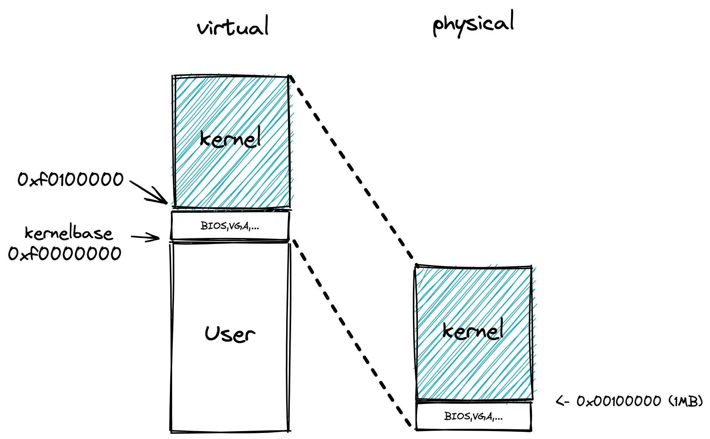
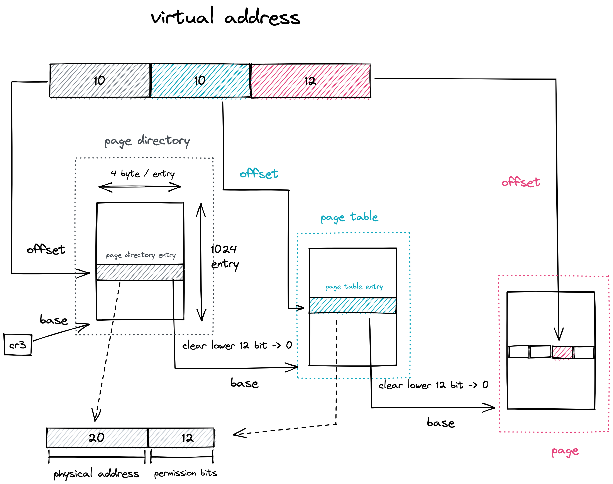
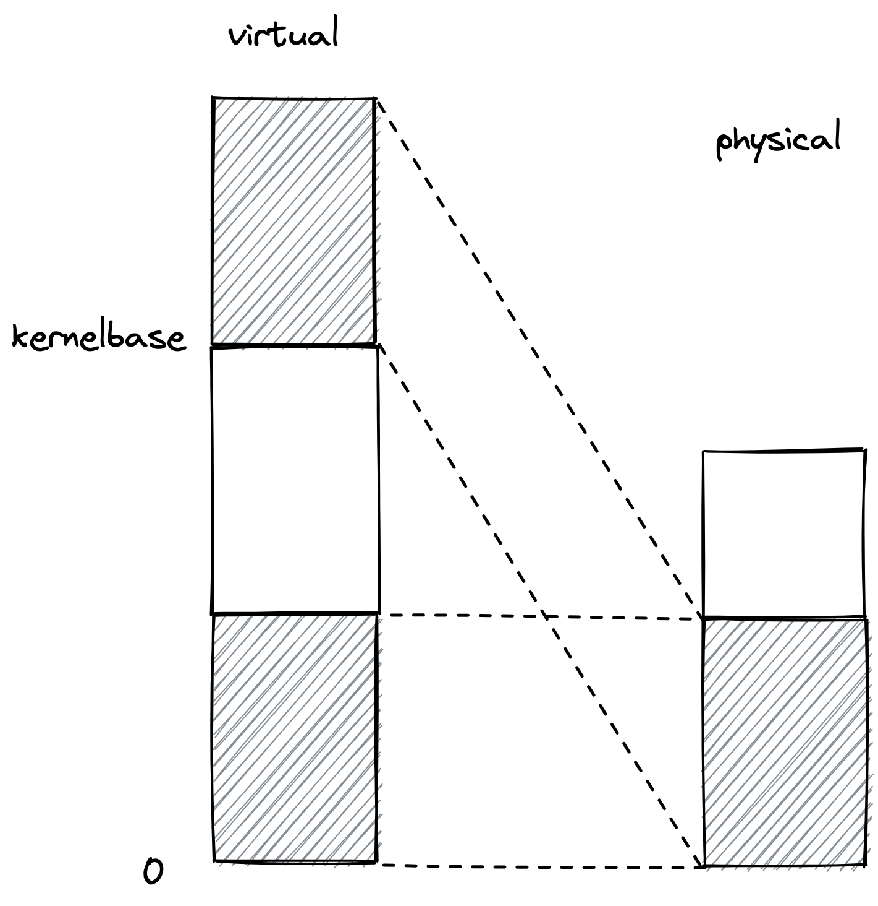
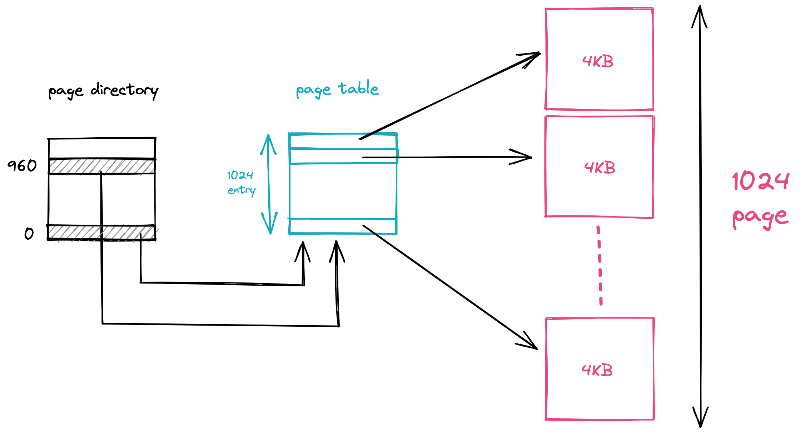

# Part 3: The Kernel

### Using virtual memory to work around position dependence

至此，我们终于进入了kernel

 在正式进入kernel的代码之前，我们需要处理part2遗留的问题，即kernel被读入的物理内存地址为0x00100000，对应的虚拟地址为0xf0100000，是如何确定的。

这两个值在ELF text段对应的program header中给出(VMA=0xf0100000, LMA=0x00100000):

```
Sections:
Idx Name          Size      VMA       LMA       File off  Algn
  0 .text         0000178e  f0100000  00100000  00001000  2**2
```

这两个值是在`kern/kernel.ld`中被设置的:

```
	/* Link the kernel at this address: "." means the current address */
	. = 0xF0100000;
	
	/* AT(...) gives the load address of this section, which tells
	   the boot loader where to load the kernel in physical memory */
	.text : AT(0x100000) {
		*(.text .stub .text.* .gnu.linkonce.t.*)
	}
```

jos中的[物理内存布局](lab1_part1.md/#physical-memory-layout)我们已经知道了，虚拟内存布局在`inc/memlayout.h`中。在lab2中，我们会将所有的物理内存(至多256MB)映射到以`kernelbase(0xf0000000)`为起点的对应位置。



完成物理地址到虚拟地址的转换需要页表的参与，在kernel启动初期，我们需要手动的设置好对应的页表，然后enable 80386的paging功能，下面的汇编完成了这些事：

```
	# Load the physical address of entry_pgdir into cr3.  entry_pgdir
	# is defined in entrypgdir.c.
	movl	$(RELOC(entry_pgdir)), %eax
f0100015:	b8 00 70 11 00       	mov    $0x117000,%eax
	movl	%eax, %cr3
f010001a:	0f 22 d8             	mov    %eax,%cr3
	# Turn on paging.
	movl	%cr0, %eax
f010001d:	0f 20 c0             	mov    %cr0,%eax
	orl	$(CR0_PE|CR0_PG|CR0_WP), %eax
f0100020:	0d 01 00 01 80       	or     $0x80010001,%eax
	movl	%eax, %cr0
f0100025:	0f 22 c0             	mov    %eax,%cr0
```

这里的RELOC定义在`entry.S`中，即将我们在c语言中定义的符号从虚拟地址转换到物理地址。

```c
#define	RELOC(x) ((x) - KERNBASE)
```

`	movl $(RELOC(entry_pgdir)), %eax`，将entry_pgdir的物理地址写入`%eax`。然后写入`%cr3`。

接着我们来看`entry_pgdir`与`entry_pgtable`的具体实现。这里默认你具备(多级)页表的相关知识，即能够理解利用页表进行虚实地址转换的过程。



在kernel启动初期，只需要将0-4MB的物理内存映射到kernelbase之上的内存处。实际上0-4MB物理内存需要被映射两次，一次映射到kernelbase处，一次映射到虚拟内存的0-4MB，如下图：



其原因在于如果不映射，在`movl %eax, %cr0`之后就开启了paging，此时所有的内存访问都是虚拟内存，需要经过MMU转换。问题就出在接下来这两句汇编：

```
	# Now paging is enabled, but we're still running at a low EIP
	# (why is this okay?).  Jump up above KERNBASE before entering
	# C code.
	mov	$relocated, %eax
	jmp	*%eax
relocated:
	# Clear the frame pointer register (EBP)
	# so that once we get into debugging C code,
	# stack backtraces will be terminated properly.
	movl	$0x0,%ebp			# nuke frame pointer
```

注释掉`entry_pgdir`中的第一项后，用gdb跟踪一下就很清晰了：

```
#comment out first entry in entry_pgdir entry_pgdir.c
pde_t entry_pgdir[NPDENTRIES] = {
	// [0] 
	// 	= ((uintptr_t)entry_pgtable - KERNBASE) + PTE_P, 
	[KERNBASE>>PDXSHIFT]
		= ((uintptr_t)entry_pgtable - KERNBASE) + PTE_P + PTE_W
};
# gdb
(gdb) si
=> 0x100025:	mov    %eax,%cr0
0x00100025 in ?? ()
(gdb) si
=> 0x100028:	Error while running hook_stop:
Cannot access memory at address 0x100028
0x00100028 in ?? ()
```

在PC=0x100025之后，PC更新为0x100028，然后去访问内存取对应的指令即`mov $relocated, %eax`，此时访问的虚拟内存地址为0x100028，page table中并没有对应项，因此无法正常访问，直接报错。

再来看看`entry_pgtable`与`entry_pgdir`的内容

```c
pte_t entry_pgtable[NPTENTRIES] = {
	0x000000 | PTE_P | PTE_W,
	0x001000 | PTE_P | PTE_W,
	...
	0x3ff000 | PTE_P | PTE_W,
	}

pde_t entry_pgdir[NPDENTRIES] = {
	[0] 
	 	= ((uintptr_t)entry_pgtable - KERNBASE) + PTE_P, 
	[KERNBASE>>PDXSHIFT]
		= ((uintptr_t)entry_pgtable - KERNBASE) + PTE_P + PTE_W
};
```

其作用如下图。

一个物理页是4KB，一个页表项(page table entry)是4 byte，所以一个物理页能放4KB / 4Byte = 1024个页表项。

也就是一个页表中有1024项，每一项对应一个4KB的物理页，所以一个页表能表示1024 x 4KB = 4MB的内存映射关系。

而一个页表对应于页目录(page directory)的一项。所以上面设置了0和960(0xf0000000 >> 22)两项，均指向`entry_pgtable`，`entry_pgtable`建立物理内存0-4MB与虚拟内存0-4MB之间的映射关系。



接着通过以下代码跳转到`relocated`处：

```
	mov	$relocated, %eax
	jmp	*%eax
relocated:
	# Clear the frame pointer register (EBP)
	# so that once we get into debugging C code,
	# stack backtraces will be terminated properly.
	movl	$0x0,%ebp			# nuke frame pointer

	# Set the stack pointer
	movl	$(bootstacktop),%esp

	# now to C code
	call	i386_init
```

`relocated`清空了`%ebp`，同时设置了栈`%esp`，然后跳转到`i386_init`完成初始化工作。


#### Formatted Printing to the Console
